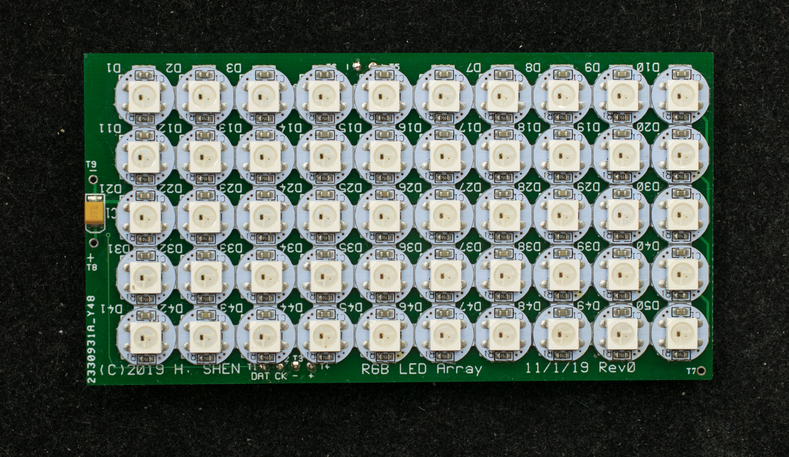
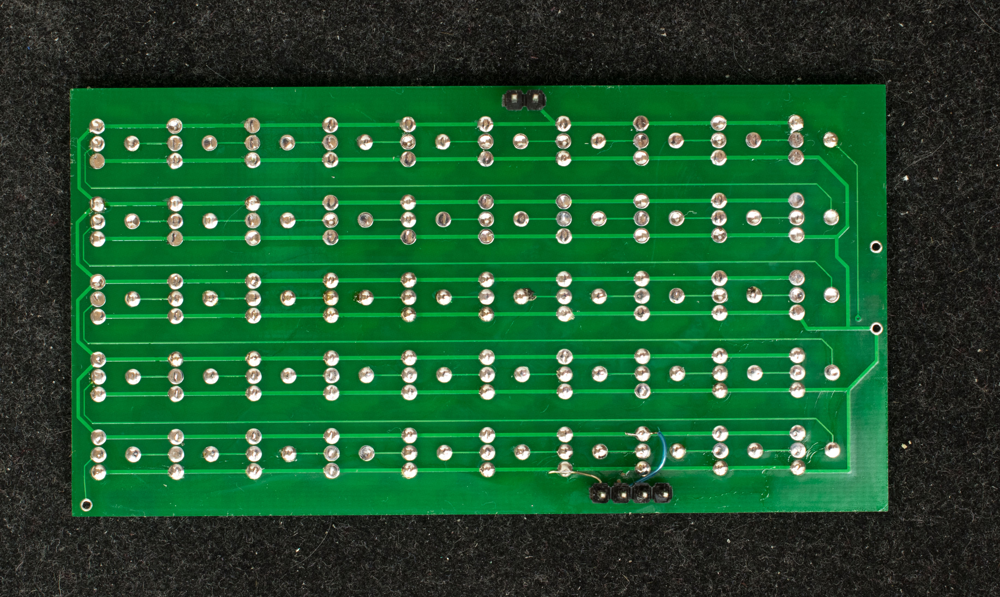

# WS2812B RGB LED Shield for Zuno
### Introduction
Shield for RGB panel is a 2”x4“ thin pc board with connectors that plugs into the I2C connector of Zuno. It hosts a 5×10 array of RGB LEDs

### Design Files
- [Schematic](Zuno_shield_rgbled_rev0_scm.pdf)
- [Gerber photoplots](zuno_shield_rgbled_r0_gerber.zip)
