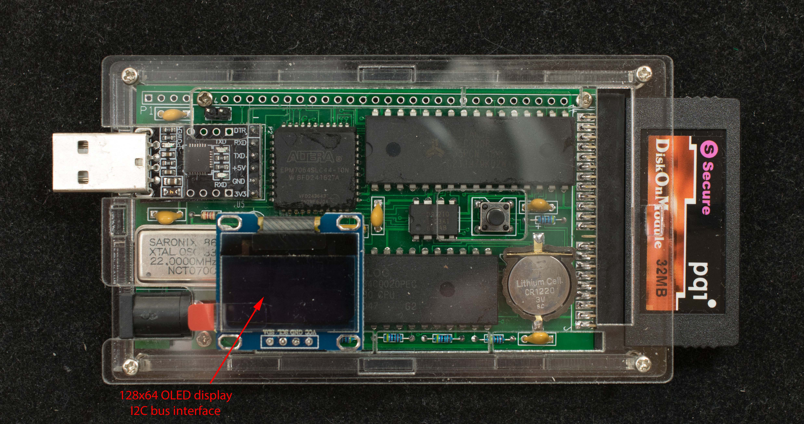

# Interface to 128x64 OLED Display
### Introduction
Zuno's I2C connector can directly interface to the popular 0.96“ 128×64 OLED that's readily available from eBay for 3-4 dollars.

### Software for 128x64 OLED
[Game of life](life_128x64_faster_released.zip), Glider gun

[YouTube video](https://www.youtube.com/watch?v=OnShBKl0Ys0) of Glider gun playing on Zuno

