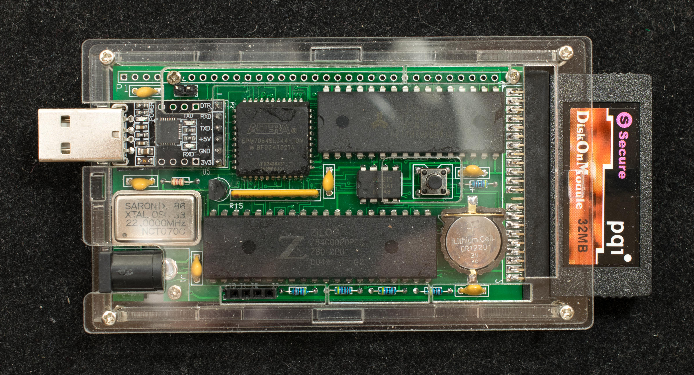
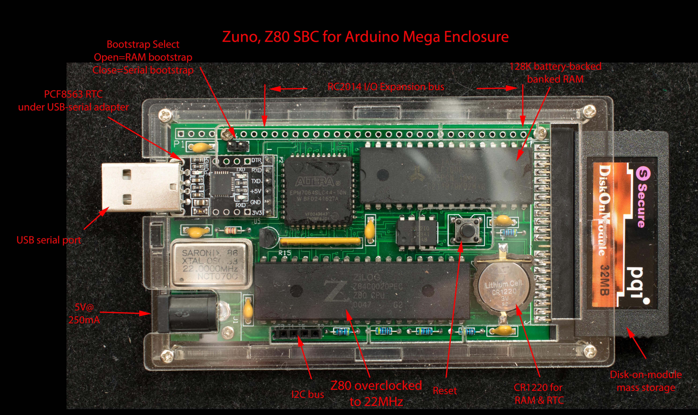

# Zuno, CP/M-ready Z80 SBC for Arduino Mega Enclosure
### Introduction
Zuno is based on Z80SBC64, but redesigned so to fit in an acrylic Arduino Mega enclosure.

### Features
- Z80 overclocked to 22MHz
- ROMless
- Battery-backed 128K RAM
- Altera EPM7064S in PLCC44 package
- 4 banks, each bank is 32KB
- Simple serial port with serial bootstrap capability
- Serial port operates at 115200 N81, no handshakes
- I2C bus
- Real-time-clock with PCF8563
- Disk-on-module mass storage
- CP/M 2.2 and CP/M 3
- RC2014 I/O bus interface

### Functions
Refer to the [Z80SBC64 Function](https://github.com/Plasmode/Z80SBC64) section for a description of the Zuno functionalities

### Design Information
- [Schematic](zuno_03_scm.pdf)
- [Gerber photoplots](zuno_r03_gerber.zip)
- [CPLD design](zuno_r03_CPLD_i2c.zip) files

### Software
Zuno software is compatible with Z80SBC64.

### Engineering Change for Rev 0.3 board
Modify I2C bus connector pin assignment, this is only applicable to rev 0.3 pc board

### Manuals
Getting Started with Zuno

Zuno monitor manual is same as Z64Mon, the monitor for Z80SBC64 and Z80MB64

Loading software into a new DOM

### Zuno Projects
Zuno has two expansion ports, I2C and RC2014. External hardware can connect to these ports for additional capabilities.

Interface to 128×64 OLED display
Interface to WS2812B pixel addressable RGB LED
Interface to RC2014 I/O modules
Bridge to RC2014 backplane
